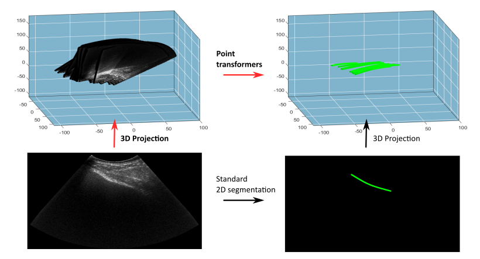

Welcome to my personal website!

About me
======
I'm Zhaoyang Chen, a master's student at Ecole Polytechnique, France. Before coming to Ecole Polytechnique, I obtained
my Bachelor's degree in Computer Science from Beijing University of Posts and Telecommunications, China. My research
interests lie in the field of artificial intelligence, especially in the area of computer vision.

Education
======
* 2024: Master of Science in Artificial Intelligence and Advanced Visual Computing, Ecole Polytechnique (France)
* 2022: Bachelor of Engineering in Computer Science, Beijing University of Posts and Telecommunications (China)

Research Experience
======

* Apr 2024 - Sep 2024: Exchange student at LTS5, EPFL (Switzerland)
* Mar 2023 - Nov 2023: Visiting student at Vision-CAIR, KAUST (Saudi Arabia)
* Mar 2021 - Dec 2021: Intern researcher at NLPR, Chinese Academy of Science (China)

Personal Projects
======

All my personal projects are hosted on my [GitHub](https://github.com/czy20000902/), here I'd like to list some of the most interesting ones:

* Uni3DL: Unified Model for 3D and Language Understanding: [Project Page](https://uni3dl.github.io)
* Star Craft Bot: [Project Page](https://github.com/czy20000902/StarCraftBot)
* Vehicle Classification Model Based on ResNet and Implicit Semantic Data Augmentation: [Project Page](https://github.com/czy20000902/Vehicle-Classification/)
* Fine-Grained Visual Categorization: [Project Page](https://github.com/czy20000902/FGVC8)

Publications
======

<table cellspacing="0" cellpadding="0">
<tr>
<td style="padding:0px;width:30%;vertical-align:middle">
  
</td>
<td style="padding:20px;width:70%;vertical-align:middle">  
  <h3>Deep Learning for Point Cloud Segmentation in 3D Freehand Ultrasound Imaging</h3>
  <b>Zhaoyang Chen</b>, Sandra Marcadent, Johann Hêches, Laureline Moser, Julien Favre, David Desseauve, Jean-Philippe Thiran
   
  <em>Submitted to IEEE IUS</em>, 2025
   
</td>
</tr>
<table cellspacing="0" cellpadding="0">
<tr>
<td style="padding:0px;width:30%;vertical-align:middle">
  
</td>
<td style="padding:20px;width:70%;vertical-align:middle">  
  <h3>Uni3DL: Unified Model for 3D and Language Understanding</h3>
  Xiang Li, Jian Ding, <b>Zhaoyang Chen</b>, Mohamed Elhoseiny.
   
  <em>ECCV</em>, 2024
   
  

    <a href="https://uni3dl.github.io/">[project]</a>
    <a href="https://arxiv.org/abs/2312.03026">[paper]</a>
  
  
</td>
</tr>